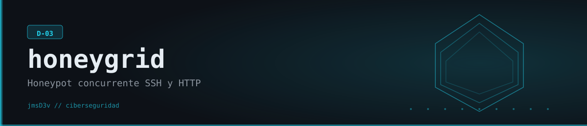

# HoneyGrid



Honeypot concurrente (D-03) que expone un servidor SSH y un servidor HTTP falsos para capturar en vivo credenciales, comandos y requests de quien intente entrar, y perfila cada sesión con IA (Claude, Gemini u OpenAI, la que tengas configurada).

## Qué hace

HoneyGrid levanta dos servicios señuelo con `asyncio`: un servidor SSH (vía `asyncssh`) que acepta **cualquier** usuario/contraseña, presenta un prompt de Ubuntu 22.04 creíble y responde a los comandos típicos (`whoami`, `cat /etc/passwd`, `wget`, `crontab -l`, etc.) con salidas falsas pero plausibles sin ejecutar nada real; y un servidor HTTP (vía `aiohttp`) que simula nginx, expone rutas trampa (`/.env`, `/.git/config`, `/wp-login.php`, `/phpmyadmin`) y devuelve contenido falso creíble para mantener a scanners y bots interesados. Cada conexión se registra como una `AttackerSession` con credenciales probadas, comandos ejecutados o requests HTTP, se clasifica automáticamente por nivel de amenaza (patrones tipo `wget`+`chmod +x`, `/etc/shadow`, SQLi/XSS en URLs) y se etiquetan técnicas MITRE ATT&CK. Todo se persiste en un JSON local después de cada sesión. Si hay alguna API key de IA configurada, un perfilador agrega un resumen del tipo de atacante (script kiddie / bot oportunista / atacante dirigido) y recomendaciones defensivas al generar el reporte HTML.

## Características

- **Honeypot SSH real** (no simulado a medias): acepta cualquier credencial (password o pubkey), abre una sesión interactiva o modo `exec`, y responde ~25 comandos comunes de reconocimiento/post-explotación con salida falsa realista (`fake_fs.py`).
- **Honeypot HTTP real**: responde como nginx/PHP, con rutas trampa que devuelven "secretos" falsos (`.env`, `.git/config`) y un formulario de login falso que registra cualquier credencial enviada.
- **Clasificación de amenaza automática**: por patrones de comandos (SSH) y por paths/payloads (HTTP: SQLi, XSS, path traversal, RCE).
- **Etiquetado MITRE ATT&CK** por sesión (T1110.001 brute force, T1105 download, T1003.008 credential harvesting, T1053.003 persistence, T1082 OS fingerprinting, etc.).
- **Captura estructurada por sesión**: intentos de auth, comandos, requests HTTP, duración, IP/puerto de origen — todo en `honeygrid_sessions.json`.
- **Perfilado con IA, sin atarse a un proveedor** al generar reportes: soporta Anthropic Claude, Google Gemini y OpenAI — usa automáticamente el que tenga API key configurada. Assessment del atacante + técnicas MITRE + 2 recomendaciones defensivas por sesión de alto riesgo.
- **CLI de análisis offline**: `sessions` (tabla filtrable por protocolo/umbral de amenaza) y `stats` (top usuarios, passwords, comandos, paths, IPs) trabajan directamente sobre el JSON, sin necesidad de tener el honeypot corriendo.
- **Modo demo**: inyecta 3 sesiones sintéticas (brute force + lateral movement, scanner HTTP, recon liviano) para probar reportes y CLI sin exponer nada a internet.
- Los campos de geolocalización (`country`, `asn`, `city`) existen en el modelo de datos pero **no hay enriquecimiento GeoIP implementado todavía** — quedan en `null` salvo que se carguen a mano (p. ej. en el modo demo).

## Requisitos

- Python **3.11+** (probado en este repo con 3.14.6 sobre Windows).
- Para el perfilado con IA en `honeygrid report` — configurá **cualquiera de estas API keys**: `ANTHROPIC_API_KEY`, `GEMINI_API_KEY` u `OPENAI_API_KEY`. Sin ninguna, el reporte se genera igual, sin la sección de IA (usar `--no-ai` para saltarla explícitamente y ahorrar la llamada). Si configurás más de una, la prioridad es: **Anthropic > Gemini > OpenAI**.
- `HONEYGRID_LOG` — opcional, define el path de log por defecto si se instancia `SessionStore()` sin argumentos; en la práctica el flag `--log` de cada comando de la CLI siempre tiene prioridad.
- Puertos: `run` por defecto usa 2222 (SSH) y 8080 (HTTP) — ambos no privilegiados, no requieren permisos de administrador ni root.

## Instalación

```bash
cd honeygrid
python -m venv .venv
source .venv/Scripts/activate      # Windows: .venv\Scripts\activate
pip install -e .

cp .env.example .env   # opcional, solo si vas a usar alguna API key de IA
```

Instalación verificada localmente: `pip install -e .` resuelve sin conflictos (asyncssh, aiohttp, typer, rich, jinja2, geoip2, google-generativeai, anthropic, openai).

## Uso

```bash
# Levantar ambos honeypots en puertos no privilegiados
honeygrid run --ssh-port 2222 --http-port 8080

# Solo SSH, o solo HTTP
honeygrid run --no-http --ssh-port 2222
honeygrid run --no-ssh --http-port 8080

# Conectarse de verdad (probado en este repo, funciona con cualquier user/pass)
ssh -p 2222 localhost
curl http://localhost:8080/
curl http://localhost:8080/.env

# Ver sesiones capturadas (con el honeypot corriendo o después de pararlo)
honeygrid sessions --log honeygrid_sessions.json --last 20 --protocol ssh

# Estadísticas agregadas: top usuarios, passwords, comandos, paths, IPs
honeygrid stats --log honeygrid_sessions.json

# Generar reporte HTML con perfilado de IA (necesita alguna API key de IA)
honeygrid report --log honeygrid_sessions.json -o reporte.html

# Reporte sin IA (no necesita API key)
honeygrid report --log honeygrid_sessions.json -o reporte.html --no-ai

# Probar todo el flujo sin exponer nada — inyecta sesiones sintéticas
honeygrid demo
honeygrid sessions --log honeygrid_demo.json
```

Verificado en este repo de punta a punta contra la instancia real: `honeygrid run --ssh-port 12222 --http-port 18080` acepta conexiones SSH reales (`ssh -p 12222 -o PreferredAuthentications=password localhost`) con cualquier usuario/contraseña, ejecuta comandos (`whoami`, `cat /etc/passwd`) devolviendo la salida falsa esperada, y responde por HTTP en `/`, `/.env` y `/wp-login.php` con contenido señuelo. Cada conexión quedó registrada correctamente en el JSON de sesiones con MITRE techniques y threat level.

## Estructura del proyecto

```
honeygrid/
├── pyproject.toml
├── .env.example
└── honeygrid/
    ├── types/events.py           # AttackerSession, AuthAttempt, CommandEntry, HttpRequest
    ├── protocols/
    │   ├── ssh_honey.py           # servidor SSH (asyncssh) + clasificación de amenaza
    │   ├── http_honey.py          # servidor HTTP (aiohttp) + rutas trampa
    │   └── fake_fs.py             # respuestas falsas por comando (ls, cat, ps, wget...)
    ├── capture/session_store.py  # store en memoria + persistencia JSON, thread-safe
    ├── core/
    │   ├── orchestrator.py       # arranca SSH+HTTP concurrentes, shutdown prolijo
    │   └── ai_profiler.py        # perfilado de atacante con Claude/Gemini/OpenAI, auto-detección por API key
    ├── report/
    │   ├── generator.py           # HTML (Jinja2) + PDF (WeasyPrint opcional)
    │   └── template.html
    └── cli/main.py                # comandos: run, sessions, stats, report, demo
```

## Aviso legal

Proyecto educativo / de portfolio, pensado para correr en un laboratorio controlado o en un segmento de red propio bajo monitoreo (VM aislada, red interna, honeypot detrás de tu propio firewall) — **no** para exponerlo directamente a internet o usarlo contra atacantes reales sin la revisión legal y operativa correspondiente (aislamiento de red, límites de responsabilidad, retención de datos capturados). Cualquier IP o credencial que capture es de terceros no identificados: tratala como dato sensible y no la publiques sin anonimizar.

<div align="center">

Copyright © [@jmsDev](https://www.linkedin.com/in/jmsilva83) — Desarrollado desde Las Breñas con 💜 · All rights reserved

</div>
